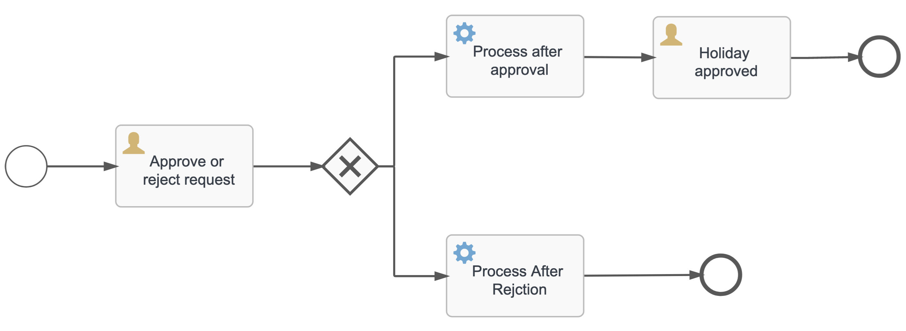
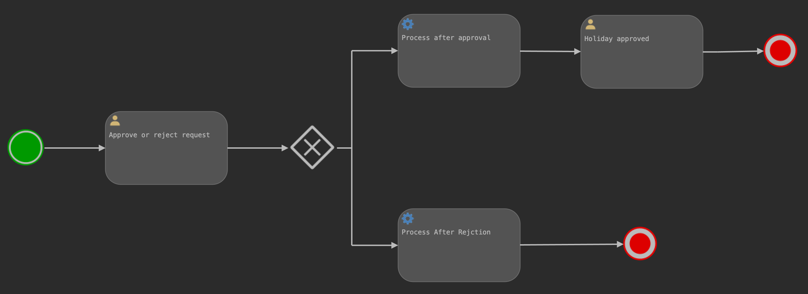

# Flowable Demo

Simple Flowable app with Spring Boot demonstrating Holiday Request business process.

## Requirements

- JDK 17
- [Curl](https://curl.se)
- [Just](https://github.com/casey/just)
- [Flowable BPMN visualizer](https://plugins.jetbrains.com/plugin/14318-flowable-bpmn-visualizer) for IntelliJ IDEA

## Basics

- Business process engine (like Flowable) can be used to make overall development easier, faster, and less error-prone
  - Business process management applications can make the entire purchase order process from creating an online purchase order until the payment, elegantly simple, and provide accountability at every important juncture. Content Marketing.
  - The process of hospitalization can be very arduous if not done right. Poor admissions and discharge process workflows alone can increase patients’ trauma. The admissions process involves multiple stages such as: collecting patient information, obtaining medical records, checking insurance details, accommodating room preferences, and so on.
  - A payment-engine that includes handling of various states through which a single transaction can go based on different scenarios, i.e. payment-failure, payment-success, payment-pending.
- Flowable is a business process engine written in Java.
- A business process or business method is a collection of related, structured activities or tasks by people or equipment in which a specific sequence produces a service or product for a particular customer or customers.
- OMG (Object Management Group) has defined a standard called Business Process Model and Notation (`BPMN`) for businesses to define and communicate their processes. It's basically a method for mapping out the approach to a business process; that is, creating a visual representation of complex business practice or process flow. This is designed to give major stakeholders the clarity and perspective required to make informed decisions, just as a well-drawn map can help you to figure out the best possible route to your destination.
- A `User Task` is a typical “workflow” Task where a human performer performs the Task with the assistance of a software application and is scheduled through a task list manager of some sort. In Flowable, User Tasks are the primary way to interact with humans within a process.
- A `Service Task` is a Task that uses some sort of service, which could be a Web service or an automated application. In Flowable, Service Tasks are used to perform some form of technical task that doesn’t require human intervention.
- A `Sequence Flow` is used to show the order of Flow Elements in a Process or a Choreography. Each Sequence Flow has only one source and only one target.
- A diverging `Exclusive Gateway` (`Decision`) is used to create alternative paths within a Process flow. This is basically the “diversion point in the road” for a Process. For a given instance of the Process, only one of the paths can be taken.

## Holiday Request Business Process

We already have Holiday Request process definition designed in file `src/main/resources/processes/Holiday_Request.bpmn20.xml`.

Visual representation in Flowable UI Modeler:

Visual representation in IntelliJ IDEA via Flowable BPMN visualizer plugin:

It's basically a holiday-approval system based out of the process that is generally followed in an organization for holiday approval:

1. Start of the process
2. Then we reach `Approval or reject request` followed by a sequence flow, that is our first user-task
    - First user task that - a manager can approve or rejects the holiday request
3. Then the exclusive gateway that leads to two different flows based on the condition on which it's being evaluated
    - The conditional entity, that triggers different flows based on the approval or rejection of the holiday in the first user-task. It decides which flow to trigger via the value of `approved` process variable for the current process instance
4. `Enter holidays in external system` and `Send out rejection email` are two service tasks in our process
    - Service tasks that get triggered if the holiday was approved or rejected by the manager i.e. `approved` variable has value true/false for the current process instance
    - Notice defined handler classes
5. `Holiday approved` is again a user task
    - 2nd User Task, using `assignee=${employee}` signifies that the assignee for this user task is the employee who raised the holiday request. As you will see in code we are storing the employee-name in employee process variable

I highly recommend to deeply analyze both XML file and how it looks in UI tools (Flowable Modeler and IDEA).

## Usage

- Execute `just run` to start the app
  - We are using in-memory H2 database for simplicity, so all the work will be lost after restart
  - Flowable Engine is exposed
  - Flowable UI apps are exposed: Admin, IDM, Task, Modeler
  - Holiday Request process definition will be automatically deployed since it's located in `processes` folder, so no need for us to do it programmatically
  - Open http://localhost:8080 and login with user `admin` and password `test` - there you will have access to mentioned UI apps
  - Admin App > Process Engine > Deployments - you will see the deployment here and below our Process Definitions - holiday request
  - Still no Process Instances
  - Now navigate back and enter into Modeler App and Import Process using our XML file - then you will be able to view and edit using UI Web tool and export again
- Execute `just holiday-apply` to initiate / create a process instance
  - It triggers the startEvent defined in the BPMN file and creates a new process instance
  - Java code is self-explanatory - we are using Flowable API to do this and return some info back to the client
  - Now if you go again to Admin App > Process Engine > Instances - you will see new process instance, current pending User Task and can show process diagram to see its current state
- Execute `just manager-tasks` to get the list of all pending tasks for manager to approve/reject
  - It will return something like this `[{"taskId":"8949fe23-58c6-11ed-9281-2aba45e3f185","taskName":"Approve or reject request","taskData":{"noOfHolidays":1,"description":"Need to recharge","employee":"Vanja"}}]` 
- Execute `just approve-task 8949fe23-58c6-11ed-9281-2aba45e3f185 true` to approve the task from above
  - In the logs you will see that `HolidayApprovalHandler` was executed
  - And if you go again to Flowable Admin, you will see that `Approve or reject request` is now completed and there is a new user task `Holiday approved` pending
  - Also, you see show the process diagram and see where the process is currently at
- Execute `just user-tasks Vanja` to get all tasks for user Vanja
- Execute `just user-accept 519bb6b7-58ce-11ed-9281-2aba45e3f185` (replace your task id) to accept the holiday
  - On the Admin page you will now see that the whole process is completed and the path that was taken
- Execute `just history 448186c4-58ce-11ed-9281-2aba45e3f185` (replace your process id)
  - Observe in the logs the history of transitions through which a process has gone from starting to end event 

## References

- https://www.flowable.com/open-source
- https://www.flowable.com/open-source/docs/bpmn/ch05a-Spring-Boot
- https://medium.com/swlh/implement-flowable-engine-using-java-e437061b6773